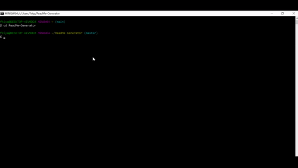

# ReadMe-Generator
  ## Table of Contents
  * [Installation](#installation)
  * [Usage](#usage)
  * [License](#license)
  * [Contributing](#contributing)
  * [Tests](#tests)
  * [Questions](#questions)

  ## Description
   This repository contains my readme generator, a homework assignment from the Case Western Reserve University’s Coding Bootcamp. The content of the readme is generated from user input in response to prompted questions. 

  ## Installation
   npm, node index.js

  ## Usage
   This project will run in the command line using node index.js

  ## Contributing
   Provide suggestions as a contributor

  ## Tests
   None

  ## License
  

  ## Questions
  gitHub Name: nfears19
  GitHub Link: <a href="https://github.com/nfears19">https://github.com/nfears19</a>
  Email: none

## WalkThrough
